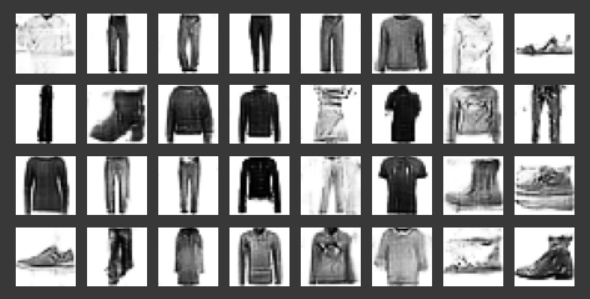

# Generate-Synthetic-Images-with-DCGANs-in-Keras
Design and train DCGANs using the Keras API in Python to generate images of fashionable clothes

## Images from Ithe Fashion-MNIST Database

## Generated Images

